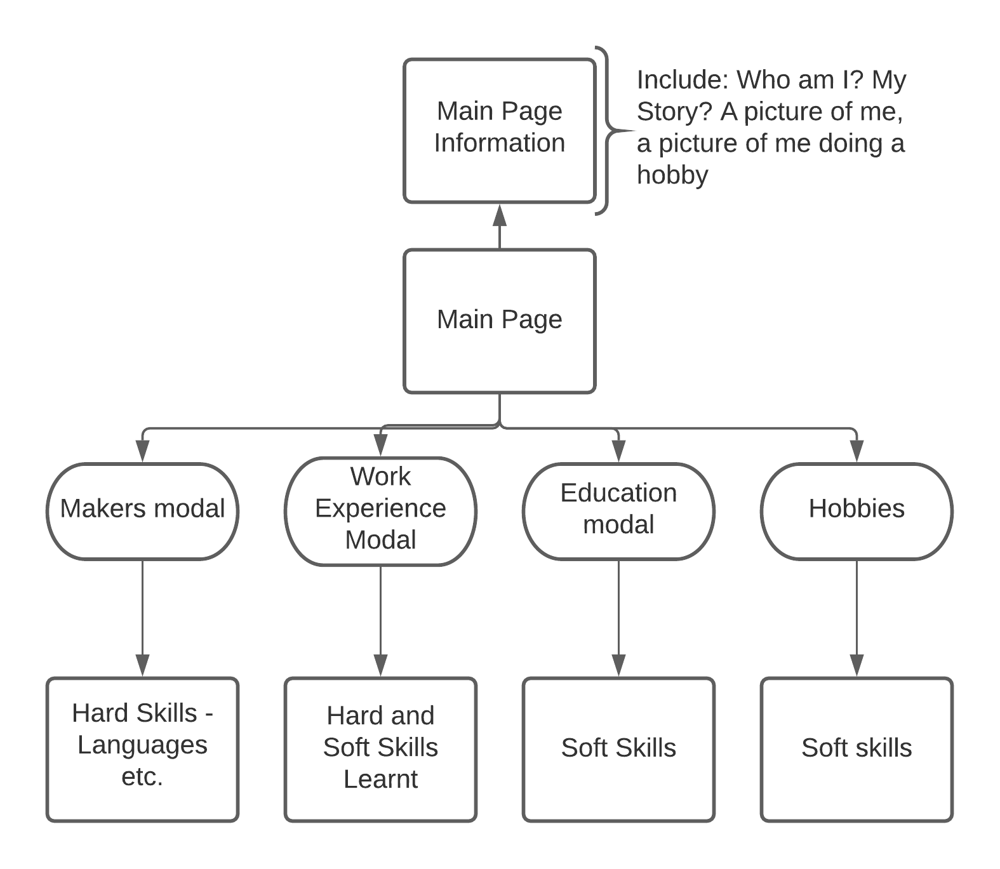

# Will Dixon 

## Diagramming

# Starting my website

At the start I wanted to create a single page app. I was able to do this following tutorials, thinking about what colours represent me etc. A single page app was useful due to the fact that I originally wanted my site to become an interactive CV. However, after spending more time on it, I have now decided I want to make a multipage website that is my brand. This requires a big rethink in terms of design, make up and adaptation. As most of the information is already there it may simply be a case of redirecting some routes. However, I have also taken some time to learn more around CSS and HTML in order to make a website that represents my abilities as a web designer and my ambition to go into UI/UX. 
